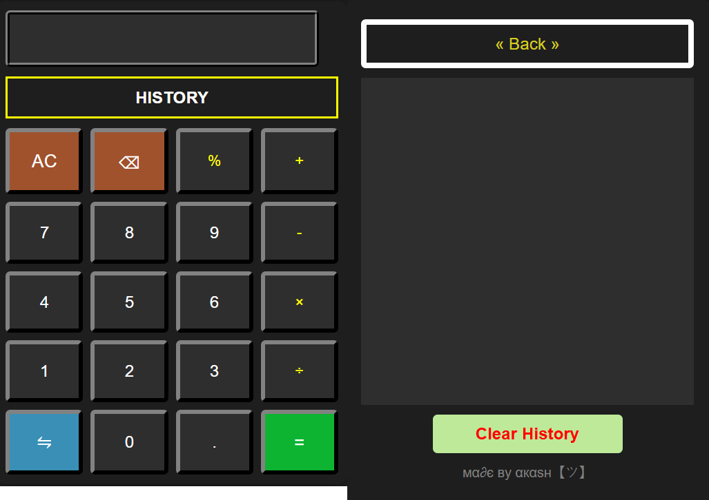

## 🔢 Ultimate Scientific Calculator
A modern, interactive, and powerful Scientific Calculator built with HTML, CSS, and JavaScript. This app supports both basic and advanced mathematical operations, along with a toggleable deg/rad mode, calculation history panel, and a responsive user interface.

# 🚀 Features
 ✅ Dual Modes:
 
   • Simple Mode – for basic arithmetic operations
   
   • Scientific Mode – includes trigonometric, logarithmic, exponential, factorial, roots, powers, and constants like π and e

 ✅ Mode Switching:
     
   • Toggle between Degrees and Radians for trigonometric functions.

 ✅ History Panel:
 
   • Displays up to the last 100 calculations.
      
   • Option to clear or go back to the calculator interface.

 ✅ Responsive UI:
 
   • Fully responsive layout.
   
   • Emulates Tkinter GUI-style button reliefs (RIDGE, RAISED, SUNKEN).

 ✅ Theme:
 
   • Dark mode with animated button feedback.

## 🖼️ Screenshots

)

## 🛠️ How to Use
  Open index.html in any modern web browser (Chrome, Firefox, Edge, etc.).
  Click ⇋ to toggle between Simple and Scientific modes.
  Use the deg/rad toggle to change trigonometric evaluation mode.
  Press HISTORY to view previous calculations.
  Use « Back » to return and Clear History to reset.

   − Click on this : https://akash098p.github.io/Scientific_Calculator/

## 📚 Functions Supported

   • Arithmetic: 
   
   +, -, ×, ÷, %, (, )

   • Scientific:
   
   sin, cos, tan, sin⁻¹, cos⁻¹, tan⁻¹ (in deg or rad)
      
   log, ln
      
   x², x³, xⁿ, √, ⁿ√, x⁻¹, !
      
   Constants: π, e

## 💡 Tech Used

   • HTML5 for structure

   • CSS3 for styling and layout

   • Vanilla JavaScript for logic and interactivity

   • localStorage API for storing calculation history

## 👨‍💻 Author
Akash Pramanik

## 📜 License
This project is licensed under the MIT License. You are free to use, modify, and distribute it.

